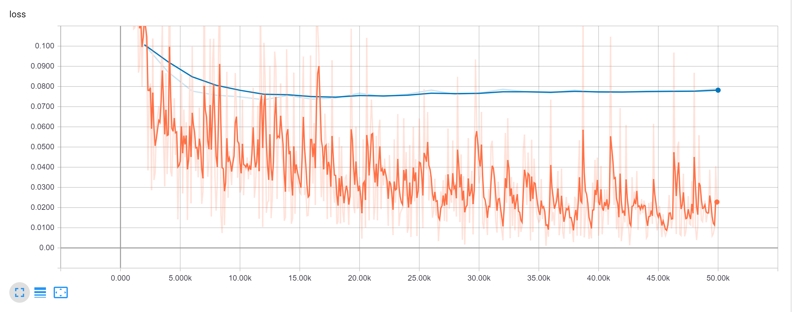
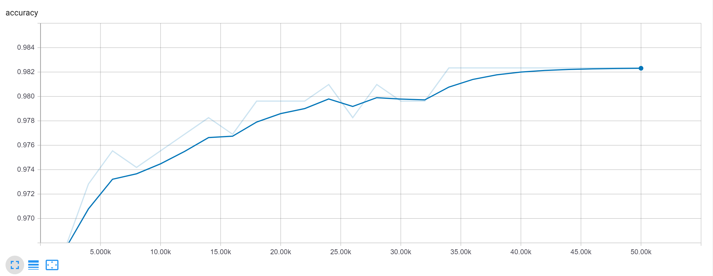

# UCI HAR Dataset fitting
Human Activity Recognition (HAR) Using Smartphones Data Set from UCI Machine learning Repository is a data set that connect people's physical activity with data from movement sensors on smartphones they carried. This data can be used to train the software that record human activity on smartphone.

UCI HAR Dataset can be found [here](https://archive.ics.uci.edu/ml/datasets/human+activity+recognition+using+smartphones).

This project is to use neural network (NN) to fit this data. To reduce the complexity and running time of NN training, a principle component analysis (PCA) is executed. The PCA model is trained based on training data set, and the result matrix is used to transform both training and testing data set. All PCs which contribute more then 0.001 in total variance are selected (totally 64 PCs). The processed data vector is used as input of NN.

The final NN consists of 4 layers:
1. Input layer: 64 as principle components number
2. Hidden layer 1: 32. Use ReLU as activation.
3. Hidden layer 2: 16. Use ReLU as activation.
4. Output layer: 6 as final class number of human activity. No activation.

Choose the class with maximal value in final logits as output in evaluating and predicting processes, while use cross entropy as loss function in training process. Stochastic gradient descent (SGD) is utilized to minimize loss functions. Detailed parameters can be reached in scripts.

Loss function during training:

Accuracy during training:

